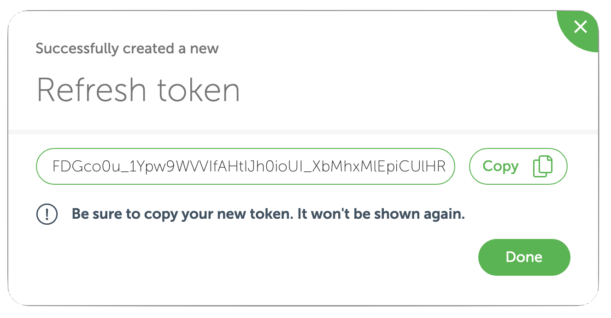

# Terraform provider

Kurrent Cloud provider for Terraform is available in the public [provider registry][terraform registry].

Provider documentation is available there as well, on the [Documentation tab](https://registry.terraform.io/providers/kurrent-io/kurrentcloud/latest/docs).

::: warning Provider Migration Notice
The legacy `EventStore/eventstorecloud` provider is deprecated. Users should migrate to the new `kurrent-io/kurrentcloud` provider registry location. See our [Migration Guide](#migration-from-eventstore-cloud-provider) below for detailed instructions.
:::

## Installation

The current version of the provider is: {{ $frontmatter.terraform_current_version }}. The releases are available in Terraform official [registry][terraform registry] and via [GitHub releases][terraform github releases].

The binaries are available for the following platforms:

| Processor | Operating system | Filename                                                                                          |
|:----------|:-----------------|:--------------------------------------------------------------------------------------------------|
| x64       | macOS            | terraform-provider-kurrentcloud_{{ $frontmatter.terraform_current_version }}_darwin_amd64.zip  |
| x64       | FreeBSD          | terraform-provider-kurrentcloud_{{ $frontmatter.terraform_current_version }}_freebsd_amd64.zip |
| x64       | Linux            | terraform-provider-kurrentcloud_{{ $frontmatter.terraform_current_version }}_linux_amd64.zip   |
| x64       | Windows          | terraform-provider-kurrentcloud_{{ $frontmatter.terraform_current_version }}_windows_amd64.zip |
| arm64     | FreeBSD          | terraform-provider-kurrentcloud_{{ $frontmatter.terraform_current_version }}_freebsd_arm64.zip |
| arm64     | Linux            | terraform-provider-kurrentcloud_{{ $frontmatter.terraform_current_version }}_linux_arm64.zip   |

### Terraform 0.13+

Terraform supports third party modules installed via the plugin registry. Add the following to your terraform module configuration:

@[code](snippets/providers_kurrentcloud.tf.hcl)

### Terraform 0.12

In order for Terraform to find the plugin, place the appropriate binary into the Terraform third-party plugin directory. The location varies by operating system:

* Linux and macOS `~/.terraform.d/plugins`
* Windows `%APPDATA%\terraform.d\plugins`

Alternatively, the binary can be placed alongside the main `terraform` binary.

You can download the provider using the following commands:

::: code-tabs#os

@tab Linux
@[code](./snippets/download_provider_linux.sh)
@tab macOS
@[code](./snippets/download_provider_macos.sh)
@tab Windows
@[code](./snippets/download_provider_windows.ps1.powershell)
:::

### Building from source

If you prefer to install from source, use the `make install` target in this [repository][terraform github]. You will need a Go 1.13+ development environment.

## Provider configuration

The Kurrent Cloud provider must be configured with an access token. There are several additional options that may be useful. Provider configuration options are:

| Option            | Environment Variable | Description                                                                                                         |
|:------------------|:---------------------|:--------------------------------------------------------------------------------------------------------------------|
| `token`           | `ESC_TOKEN`          | *Required*, your access token for Kurrent Cloud.                                                                |
| `organization_id` | `ESC_ORG_ID`         | *Required*, your Kurrent Cloud organization ID.                                                                 |
| `url`             | `ESC_URL`            | *Optional*, the URL of the Kurrent Cloud API. This defaults to the public cloud instance of Kurrent Cloud.  |
| `token_store`     | `ESC_TOKEN_STORE`    | *Optional*, the location on the local filesystem of the token cache. This is shared with the Kurrent Cloud CLI. |

### Obtaining the access token

You can use the [Kurrent Cloud console][cloud console tokens] or the [Kurrent Cloud CLI][esc cli github releases] (`esc-cli`) to obtain a token

Use the following command to get the access token using `esc-cli`:

```bash
$ esc access tokens create --email <email>

Password:
Token created for audience https://api.kurrent.cloud
FDGco0u_1Ypw9WVVIfAHtIJh0ioUI_XbMhxMlEpiCUlHR
```

If you prefer to use the Cloud Console, navigate to the [Authentication Tokens](https://console.kurrent.cloud/authentication-tokens) page, then click on "Request refresh token" button.



### Obtaining the organisation ID

As for the token, you can use the Cloud Console, or `esc-cli` to get the organisation ID.

That's how you do it with `esc-cli`:

```bash
$ esc resources organizations list
Organization { id: OrgId("9bdf0s5qr76g981z5820"), name: "Kurrent, Inc"
```

In the Cloud Console, open the [organisations page][cloud console organizations]. Then, select the organisation from the list and go to its settings. There, you can copy the organisation ID.

## Resources

All resources in Kurrent Cloud can be provisioned using the Terraform provider. Existing projects can be queried using a data source in the provider. More complete samples can be found [here][terraform github samples].

Using the Terraform provider, you can create, manipulate, and delete the following resources in Kurrent Cloud:

| Terraform resource                | Kurrent Cloud resource                                          |
|:----------------------------------|:----------------------------------------------------------------|
| `kurrentcloud_project`         | [Project](#projects)                                            |
| `kurrentcloud_network`         | [Network](#networks)                                            |
| `kurrentcloud_peering`         | [Network peering](#network-peerings)                            |
| `kurrentcloud_managed_cluster` | [Managed KurrentDB instance or cluster](#managed-kurrentdb)                           |

### Projects

You can create Kurrent Cloud projects for the organisation using the `kurrentcloud_project` resource. You only need to provide the new project name, which must be unique within the organisation.

You need a project to provision any other resource.

#### Arguments

| Name   | Type     | Description                          |
|:-------|:---------|:-------------------------------------|
| `name` | `string` | *Required*, the name of the project. |

#### Attributes

The Project Terraform resource will get the following attributes:

| Name | Type     | Description |
|:-----|:---------|:------------|
| `id` | `string` | Project ID  |

You will need the project ID to provision other resources within the project.

#### Creating a project

Here is an example of a Terraform script to create a project in Kurrent Cloud:

@[code](./snippets/kurrentcloud_project.create.tf.hcl)

### Networks

Before provisioning a database cluster, you need a network, which the cluster will connect to. Use the `kurrentcloud_network` resource to provision a new Kurrent Cloud network. The network should be in the same cloud provider, which you plan to use for the database cluster.

#### Arguments

| Name                | Type     | Description                                                                |
|:--------------------|:---------|:---------------------------------------------------------------------------|
| `name`              | `string` | *Required*, the new network name.                                          |
| `project_id`        | `string` | *Required*, the project ID of the new network (see [Projects](#projects))  |
| `resource_provider` | `string` | *Required*, the network cloud provider (`aws`, `gcp`, `azure`).            |
| `region`            | `string` | *Required*, the cloud region of the new network (cloud provider-specific). |
| `cidr_block`        | `string` | *Required*, the new network IP range.                                      |

#### Attributes

| Name | Type     | Description    |
|:-----|:---------|:---------------|
| `id` | `string` | The project ID |

Region names must be in the format used by the cloud resource provider, for example `us-west-2` for AWS, `East US` for Azure, `us-east1` for GCP.

**Note** For the IP range, the maximum prefix length is `/9` and  the minimum is `/24`. However, cloud providers have their own limitations on the network ranges they support. Learn more in your cloud provider documentation:

* AWS [VPC Addressing](https://docs.aws.amazon.com/vpc/latest/userguide/vpc-ip-addressing.html)
* Azure [Virtual Network FAQ](https://docs.microsoft.com/en-us/azure/virtual-network/virtual-networks-faq#what-address-ranges-can-i-use-in-my-vnets)
* GCP [VPC Network](https://cloud.google.com/vpc/docs/vpc#valid-ranges)

Smaller networks can hold fewer managed clusters, but may be easier to peer to infrastructure hosting your applications.

#### Creating a network

@[code](./snippets/kurrentcloud_network.create.tf.hcl)

### Network peerings

When you got a network provisioned, you can already start creating database clusters. However, you won't be able to connect to your new cluster, unless you create a peering link between the network in Kurrent Cloud, and the network on your own cloud account or project.


Use the `kurrentcloud_peering` resource to initiate the peering link. You will need to collect the details about your own cloud network (VPC or Virtual Network) as described in the arguments list below. Depending on the cloud provider, you'll need to complete some actions on your side to confirm the peering.

At the moment, you can only peer the networks, which are in the same cloud region.

::: tip
The format of the following arguments depends on the cloud provider:

* `peer_account_id`
* `peer_network_region`
* `peer_network_id`
:::

#### Arguments

| Name                     | Type     | Description                                                                                             |
|:-------------------------|:---------|:--------------------------------------------------------------------------------------------------------|
| `name`                   | `string` | *Required*, the new peering name.                                                                       |
| `project_id`             | `string` | *Required*, the project ID for the new peering.                                                         |
| `network_id`             | `string` | *Required*, the Kurrent Cloud network ID, for which the peering will be created.                     |
| `peer_resource_provider` | `string` | *Required*, the cloud resource provider of the given network (`aws`, `gcp`, `azure`).                   |
| `peer_network_region`    | `string` | *Required*, the cloud region of your own network, which you are going to peer with.                     |
| `peer_account_id`        | `string` | *Required*, your cloud account ID, your cloud network should belong to that account.                    |
| `peer_network_id`        | `string` | *Required*, the network ID for your own cloud network.                                                  |
| `routes`                 | `string` | *Required*, CIDR blocks in your cloud network, which should be routed to the Kurrent Cloud network. |

Use the following provider-specific values for the `peer_account_id` argument:

| Cloud | Account ID is |
|:------|:--------------|
| AWS   | Account ID    |
| GCP   | Project ID    |
| Azure | Tenant ID     |

For the `peer_network_id`, use the following cloud network property:

| Cloud | Network ID is               |
|:------|:----------------------------|
| AWS   | VPC ID                      |
| GCP   | VPC name                    |
| Azure | Virtual network resource ID |

::: tip
- `peer_resource_provider` - currently, this must be the same as the resource provider of the Kurrent Cloud network.
- `peer_network_region` - currently, this must be the same as the region of the Kurrent Cloud network, and specified in the format used by your cloud. For example `us-west-2` for AWS, `westus2` for Azure and `us-east1` for GCP
- `routes` - typically, this consists of one element, the address space of a subnet in your managed network.
:::

#### Attributes

After completing the operation, the peering Terraform resource will get the following attributes:

| Name                  | Type     | Description                                                                                      |
|:----------------------|:---------|:-------------------------------------------------------------------------------------------------|
| `id`                  | `string` | The peering ID.                                                                                  |
| `provider_metadata`   | `string` | The peering resource metadata, set by the cloud provider.                                        |
| `aws_peering_link_id` | `string` | The AWS peering link ID.                                                                         |
| `gcp_project_id`      | `string` | GCP project ID.                                                                                  |
| `gcp_network_name`    | `string` | GCP VPC name.                                                                                    |
| `gcp_network_id`      | `string` | GCP network ID in URL format, which can be passed to `google_compute_network_peering` resources. |

For AWS, you'd need to confirm the peering request, use the `aws_peering_link_id` resource attribute for that purpose.

For GCP, you need to initiate a peering from your cloud account to Kurrent Cloud. Use the resource attributes with `gcp` prefix to automate that part.

#### Creating a peering

Here is an example how to initiate a peering from Kurrent Cloud to your own AWS account:

@[code](./snippets/kurrentcloud_peering.create.tf.hcl)

### Managed KurrentDB

Use the `kurrentcloud_managed_cluster` resource to provision a KurrentDB cluster or instance. You will need the [Project](#projects) and the [Network](#networks) resource information from previously created resources.

#### Arguments

| Name               | Type     | Description                                                                                                                                                      |
|:-------------------|:---------|:-----------------------------------------------------------------------------------------------------------------------------------------------------------------|
| `name`             | `string` | *Required*, the name of the managed. cluster.                                                                                                                    |
| `project_id`       | `string` | *Required*, the ID of the project in which the managed cluster should be created.                                                                                |
| `network_id`       | `string` | *Required*, the ID of the Kurrent Cloud network into which the managed cluster should be created.                                                             |
| `topology`         | `string` | *Required*, the topology of the managed cluster. This determines the fault tolerance of the cluster. Valid values are `single-node` and `three-node-multi-zone`. |
| `instance_type`    | `string` | *Required*, the size of the instances to use in the managed cluster.                                                                                             |
| `disk_size`        | `int`    | *Required*, the size of the data disks in gigabytes. Minimal size is 10Gb. All cluster members will get a disk of the same size.                                 |
| `disk_type`        | `string` | *Required*, `GP2`, `GP3` (AWS), `premium-ssd-lrs` (Azure), `ssd` (GCP).                                                                                          |
| `disk_iops`        | `int`    | *Optional*, the number of IOPS for data disk. *Required* if disk_type is `GP3`.                                                                                  |
| `disk_throughput`  | `int`    | *Optional*, throughput in MB/s for data disk. *Required* if disk_type is `GP3`.                                                                                  |
| `server_version`   | `string` | *Required*, `23.10`, `24.10`, `25.0`|
| `projection_level` | `string` | *Optional*, default: `off` , the mode in which to enable projections. Valid values are `off` , `system` , `user`.                                                |

Supported instance sizes are:

| Size   | Specification                                                    |
|:-------|:-----------------------------------------------------------------|
| `F1`   | 2 vCPU 1Gb RAM (burstable instance, not suitable for production) |
| `C4`   | 2 vCPU 8Gb RAM                                                   |
| `M8`   | 2 vCPU 8Gb RAM (same resources as `C4`, but storage-optimised)   |
| `M16`  | 4 vCPU 16Gb RAM                                                  |
| `M32`  | 8 vCPU 32Gb RAM                                                  |
| `M64`  | 16 vCPU 64Gb RAM                                                 |
| `M128` | 32 vCPU 128Gb RAM                                                |

::: tip
The actual implementation of each topology is specific to the resource provider.

For GCP and AWS clusters you can resize the disks without downtime. In Azure, it is currently not supported, please plan the disk size according to your projected database size.
:::

#### Attributes

After completing the operation, the KurrentDB cluster Terraform resource will get the following attributes:

| Name                | Type     | Description                                                                                     |
|:--------------------|:---------|:------------------------------------------------------------------------------------------------|
| `id`                | `string` | the ID of the cluster.                                                                          |
| `dns_name`          | `string` | the DNS name at which the cluster can be found.                                                 |
| `resource_provider` | `string` | the resource provider into which the cluster was provisioned.                                   |
| `region`            | `string` | the region in which the cluster was provisioned.                                                |
| `gcp_network_name`  | `string` | network name for the peering link in GCP.                                                       |
| `gcp_network_id`    | `string` | GCP Network ID in URL format which can be passed to `google_compute_network_peering` resources. |

::: tip
Attribute values for `region` and `resource_provider` are controlled by the network in which the cluster is created.
:::

#### Creating a cluster

Here are the cloud-specific examples of a Terraform script to create a managed KurrentDB cluster:

::: code-tabs
@tab AWS
@[code](./snippets/kurrentcloud_managed_cluster.create.aws.tf.hcl)
@tab Azure
@[code](./snippets/kurrentcloud_managed_cluster.create.az.tf.hcl)
@tab GCP
@[code](./snippets/kurrentcloud_managed_cluster.create.gcp.tf.hcl)
:::

## Data sources

The following data source is available:

| Terraform resource        | Kurrent Cloud resource |
|:--------------------------|:---------------------------|
| `kurrentcloud_project` | [Project](#project)        |

### Project

Use the `kurrentcloud_project` data source to query your Kurrent Cloud projects.

#### Arguments

| Name | Type   | Description                          |
|:-----|:-------|:-------------------------------------|
| name | string | *Required*, the name of the project. |
| id   | string | *Optional*, the name of the project. |

#### Looking up a project

@[code](./snippets/kurrentcloud_project.lookup.tf.hcl)

::: tip
The value of `kurrentcloud_project.name` is case-sensitive, so `Production Project` is not the same as `^production project`.
:::

## Migration from EventStore Cloud Provider

If you're migrating from the legacy `EventStore/eventstorecloud` provider to `kurrent-io/kurrentcloud`, this section provides comprehensive migration instructions.

### Quick Migration Summary

1. **Provider Registry**: Change from `EventStore/eventstorecloud` to `kurrent-io/kurrentcloud`
2. **Resource Prefixes**: `eventstorecloud_*` resources are deprecated, use `kurrentcloud_*` instead
3. **Version 2.0.0+**: Both prefixes supported for backward compatibility

### Provider Source Migration

#### Before (deprecated)
```hcl
terraform {
  required_providers {
    eventstorecloud = {
      source  = "EventStore/eventstorecloud"
      version = "~> 1.0"
    }
  }
}

provider "eventstorecloud" {
  token           = "your-token"
  organization_id = "your-org-id"
}
```

#### After (recommended)
```hcl
terraform {
  required_providers {
    kurrentcloud = {
      source  = "kurrent-io/kurrentcloud"
      version = "~> 2.0"
    }
  }
}

provider "kurrentcloud" {
  token           = "your-token"
  organization_id = "your-org-id"
}
```

### Terraform State Migration

If you have existing resources managed by the old provider, migrate them using the `terraform state replace-provider` command:

#### Step 1: Backup Your State
::: danger Important
Always backup your Terraform state before making changes:
:::

```bash
# Create a backup of your current state
terraform state pull > terraform.tfstate.backup
```

#### Step 2: Replace Provider in State
```bash
terraform state replace-provider \
  registry.terraform.io/EventStore/eventstorecloud \
  registry.terraform.io/kurrent-io/kurrentcloud
```

For automatic approval (useful in CI/CD pipelines):
```bash
terraform state replace-provider -auto-approve \
  registry.terraform.io/EventStore/eventstorecloud \
  registry.terraform.io/kurrent-io/kurrentcloud
```

#### Step 3: Update Configuration and Reinitialize
```bash
terraform init
```

### Resource Prefix Migration

#### Available Resources

**New `kurrentcloud_` resources (recommended):**
- `kurrentcloud_project`
- `kurrentcloud_acl`
- `kurrentcloud_network`
- `kurrentcloud_peering`
- `kurrentcloud_managed_cluster`
- `kurrentcloud_scheduled_backup`
- `kurrentcloud_integration`

**Deprecated `eventstorecloud_` resources (still supported):**
- `eventstorecloud_project`
- `eventstorecloud_acl`
- `eventstorecloud_network`
- `eventstorecloud_peering`
- `eventstorecloud_managed_cluster`
- `eventstorecloud_scheduled_backup`
- `eventstorecloud_integration`

#### Updating Resource Prefixes

##### Method 1: Using terraform state mv
```bash
# Backup your state first
terraform state pull > terraform.tfstate.backup

# Update configuration files, then move resources in state
terraform state mv eventstorecloud_project.my_project kurrentcloud_project.my_project
terraform state mv eventstorecloud_managed_cluster.my_cluster kurrentcloud_managed_cluster.my_cluster

# Verify no changes needed
terraform plan
```

##### Method 2: Using moved Blocks (Terraform v1.1+)
Add temporary `moved` blocks to your configuration:

```hcl
# Temporary moved block - remove after successful migration
moved {
  from = eventstorecloud_managed_cluster.my_cluster
  to   = kurrentcloud_managed_cluster.my_cluster
}

# Updated resource with new prefix
resource "kurrentcloud_managed_cluster" "my_cluster" {
  name         = "production-cluster"
  project_id   = "my-project-id"
  network_id   = "my-network-id"
  instance_type = "F1"
  disk_size    = 24
  disk_type    = "GP2"
  server_version = "23.10"
}
```

Then run:
```bash
terraform plan  # Should show move operations
terraform apply
```

### Migration Best Practices

1. **Test in Non-Production First** - Always test the migration process in a development environment
2. **Plan Your Migration** - Review all resources that will be affected
3. **Gradual Migration** - Migrate one resource type at a time
4. **Version Pinning** - Pin your provider version during migration for consistency

### Troubleshooting Common Issues

#### Issue: `terraform init` fails after state migration
```
Error: Failed to query available provider packages
```
**Solution**: Clear the `.terraform` directory and run `terraform init` again:
```bash
rm -rf .terraform .terraform.lock.hcl
terraform init
```

#### Issue: Provider not found during plan/apply
```
Error: Registry does not have a provider named registry.terraform.io/EventStore/eventstorecloud
```
**Solution**: Ensure you've completed both state migration and configuration updates, then run `terraform init`.

#### Issue: Plan shows destroy/create operations
::: danger Warning
If you see destroy/create operations, **DO NOT APPLY** - this would destroy your infrastructure.
:::

**Solution**:
1. Check that you updated your configuration files correctly
2. Verify the state mv command syntax
3. Ensure both resource types point to the same underlying resource schema

### Getting Help

::: tip Additional Resources
- **Detailed Migration Guide**: See our [GitHub MIGRATION.md](https://github.com/kurrent-io/terraform-provider-kurrentcloud/blob/trunk/MIGRATION.md) for comprehensive technical documentation
- **Provider Documentation**: [Terraform Registry Documentation](https://registry.terraform.io/providers/kurrent-io/kurrentcloud/latest/docs)
- **Support**: Open an issue in the [GitHub repository](https://github.com/kurrent-io/terraform-provider-kurrentcloud/issues)
:::

## FAQ

**Error `error obtaining access token: error 400 requesting access token`**

You need to add the access token to your environment variables or the provider configuration. See [here](#provider-configuration).

**Error `... Forbidden: Access to the requested method for the requested resources was denied`**

Make sure you used the correct organisation ID. Use [these guidelines](#provider-configuration) to get the correct value.

**Error `Your query returned no results. Please change your search criteria and try again.`**

Ensure you entered the correct project name. Remember that data source names are case-sensitive. See [here](#project).

[terraform github releases]: https://github.com/kurrent-io/terraform-provider-kurrentcloud/releases
[terraform github]: https://github.com/kurrent-io/terraform-provider-kurrentcloud
[terraform github samples]: https://github.com/kurrent-io/terraform-provider-kurrentcloud/tree/trunk/examples
[terraform registry]: https://registry.terraform.io/providers/kurrent-io/kurrentcloud/latest
[esc]: https://eventstore.com/event-store-cloud/
[esc cli github]: https://github.com/kurrent-io/esc
[esc cli github releases]: https://github.com/kurrent-io/esc/releases
[cloud console]: https://console.eventstore.cloud/
[cloud console tokens]:https://console.eventstore.cloud/authentication-tokens
[cloud console organizations]:https://console.eventstore.cloud/organizations
[pulumi provider]: https://github.com/kurrent-io/pulumi-eventstorecloud
