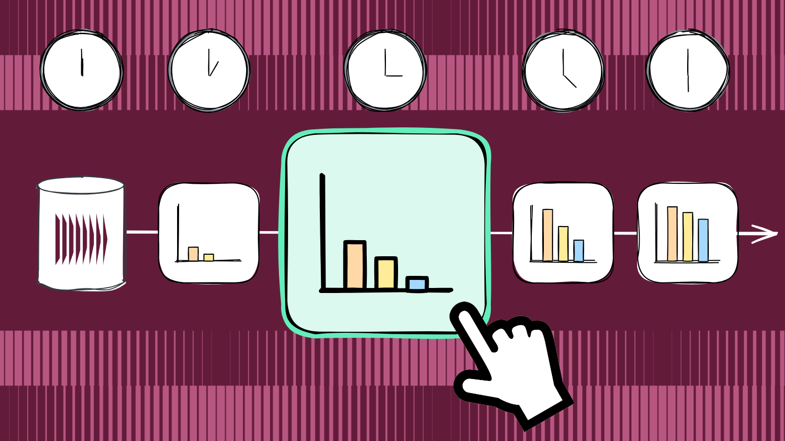

## What is Time Traveling?
Time traveling in data systems means being able to query or reconstruct your data as it existed at any point in the past. This is useful for many scenarios, such as auditing, debugging, compliance, and analytics.

| Use Case                   | Example |
|--------------------------------------|---------|
| Business process reconstruction | See the full lifecycle of a loan application, including every approval, rejection, and amendment, to resolve disputes or meet regulations |
| Point-in-time state diffing | Show exactly what changed in a customer’s profile or account settings between two points in time for support or compliance reviews |
| Simulation and what-if analysis | Simulate the impact of a pricing change or business rule adjustment by replaying all related product and sales events to see how outcomes would differ |
| Business event tracing | Audit the sequence of business events for a transaction (order placed, payment received, shipment sent, delivery confirmed) to verify SLAs or investigate complaints |
| Timeline-Based State Inspection | Let users view a timeline of how their account or order changed, with each step tied to a business event (like address updated, item added, return requested) |
| Temporal aggregate calculation | Track how total sales for a product changed over time by calculating monthly sales at the end of each month |

## Time Traveling with Traditional Approaches
Traditional databases struggle with historical queries because they are designed to store only the current state. Retrieving or reconstructing previous versions often requires extra mechanisms like audit logs, snapshots, or CDC with time-partitioned data lakes. These approaches add complexity, slow down queries, and may not always provide a complete or reliable view of historical data.

#### Audit Logs
Audit logs are a common approach in traditional databases for tracking changes. They record each modification as a new entry in a separate log table, typically including details such as who made the change, when it occurred, and what operation was performed.

**Advantages:**  
- Provide a detailed record of changes.
- Can answer questions about who changed what and when.
- Useful for meeting regulatory requirements for tracking changes.

**Limitations:**  
- Audit logs are separate from main data, risking inconsistencies if not commited together.
- Often capture only high-level operations.
- Gaps or missed events make it difficult to reconstruct past states.

#### Snapshots
Snapshots are another traditional method for preserving historical data. A snapshot captures the entire state of a table or dataset at a specific point in time, often on a scheduled basis (e.g., nightly or weekly), and stores it as a separate copy.

**Advantages:**  
- Provide a complete view of data.
- Useful for restoring data after accident.
- Easy to implement without major changes to existing applications.

**Limitations:**  
- Snapshots are taken infrequently.
- Storage requirements can be high.
- Snapshots lack a detailed audit trail of individual changes.

#### Change Data Capture (CDC) and Data Lake
Change Data Capture (CDC) is a technique that tracks and records changes (inserts, updates, deletes) in source databases and delivers them to downstream systems, often storing them in time-partitioned data lakes for analytics and historical queries.

**Advantages:**  
- Captures detailed change events, enabling near real-time replication and analytics.
- Supports integration with data warehouses and lakes for large-scale historical analysis.
- Can be used to build audit trails and reconstruct state changes over time.

**Limitations:**  
- CDC pipelines add operational complexity and require many moving parts
- Do not persist the actual change from the source, so lost events mean state can't be reliably reconstructed.
- Captured changes are usually low-level and technical, making business intent unclear.

## Time Traveling with KurrentDB

KurrentDB makes time travel simple by recording every change as an immutable, ordered event. This lets you accurately reconstruct any previous state, making historical queries, audits, and analysis straightforward without complex workarounds.

KurrentDB makes this possible because:

- It stores every change as an immutable event, preserving a complete and accurate history.
- It allows event streams to be replayed at any time for simulation, testing, and debugging—even far into the future.
- Its historical event log is naturally suited for regulatory and compliance needs, making audits and reporting straightforward.
- It supports outbox pattern out of the box, ensuring reliable delivery of historical events to downstream systems.
- It promotes events are modeled around business intent, providing clear context for historical queries.
- Events are small and focused, making them efficient to store and process.
- It handles storage, indexing, and pushing events natively, reducing the need for extra components in your time travel solution.

## How to Time Travel with KurrentDB

- **Store events in ordered streams:** Record every relevant change as an event in KurrentDB, ensuring events are stored in the order they occurred.
- **Replay events on-demand:** Replay all the relevant events from stream up to the desired timestamp or version.
- **Pre-compute state for efficiency:** For objects with long histories or frequent queries, you can periodically store snapshots of state. This reduces the number of events that need to be replayed for common queries.

KurrentDB’s approach makes time travel queries reliable, flexible, and efficient, supporting both detailed investigations and high-performance analytics.