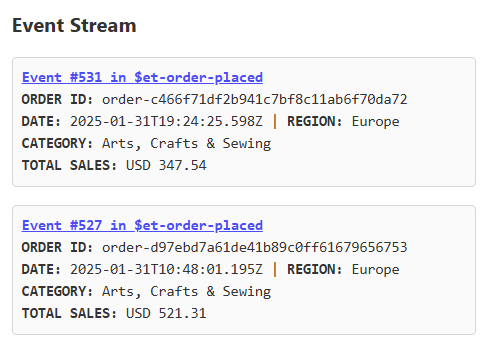
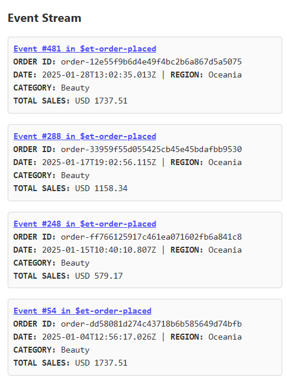

# Part 5: Time Travel with On-demand Event Replay

In the previous section, you learned how to enable time-traveling functionality in the report web app by using projections to add historical snapshots of the report to the read model for quick querying.

Time-traveling can be implemented in various ways, and pre-computing read model is just one approach. Another simpler method is to replay events on-demand from a stream up to a specific point in time.

::: tip Constructing Read Models: Pre-computed vs. On-demand Approaches
Read models are generally constructed in two ways:

**Pre-computed Read Models:**
- Events are processed in the background and projected into pre-computed views
- Results are stored in a database or file (like the JSON report in the previous part)
- Deliver optimized query performance through pre-computation, ideal for read-heavy applications with frequent access patterns that require minimal query-time processing
- This was demonstrated in the last part where the read model is stored as a JSON file

**On-demand Read Models:**
- Events are read and processed at query time directly from the event store
- Read models are constructed on-the-fly when requested
- Offer always-current data with no staleness concerns while maintaining architectural simplicity and eliminating the need for duplicate storage
- This is demonstrated in this part where the read model is returned to the caller immediately

You should always choose the approach that best fits your specific use case requirements.
:::

In this section, you will explore how to enable time-traveling by leveraging KurrentDB's ability to read events on-demand up to a certain point.

::: tip Why KurrentDB Makes On-Demand Time Travel Easy
In many traditional systems, reconstructing historical data can be challenging. This is because such systems often require you to create periodic snapshots, or they use message brokers that delete messages once they are consumed. As a result, it becomes difficult or even impossible to revisit the exact state of your data at a specific point in the past.

KurrentDB takes a different approach. It immutably stores every event, so no event is ever lost or overwritten. This lets you replay events up to any point in time, on demand, to reconstruct the exact state of your data, even years after the original events occurred. This enables powerful auditing, debugging, and compliance, ensuring your historical data is always accessible when needed.
:::

## Step 10: Discover the Auditing Capabilities in the Report Web Application

The report web application includes auditing features that demonstrate time-traveling through on-demand event replay. These capabilities allow you to examine which events contributed to specific sales figures and at different points in time.

1. Run this command in the terminal to start the sales report web application:
   
   ```sh
   ./scripts/start-web.sh
   ```

   You will receive a message, like below, printed in the terminal:

   ```
   All apps are running.

   URL to Demo Web Application 👉 http://XXXXXXXX
   ```

2. Copy the URL printed in the terminal and navigate to it in a browser.

3. Click on the following cell:

   - **Metric**: Daily Sales
   - **Category**: Beauty
   - **Region**: Oceania
  
   Notice the events displayed on the right. These events represent the contributions to the daily sales.

   

   ::: info Quick Quiz
   Do the totals of the events add up to the daily sales?
   :::

4. Click on the link `Event #531 in $et-order-placed`

   This opens up KurrentDB Admin UI to show the details of the event.

   ::: info Quick Quiz
   Do the prices and amounts in the line items add up to the total shown in the event summary in the report?
   :::

5. Click on the following cell:

   - **Metric**: Total Monthly Sales
   - **Category**: Beauty
   - **Region**: Oceania

   The events on the right now displays events that contributed to the total monthly sales.

   

   ::: info Quick Quiz
   Do the totals of the events add up to the total monthly sales?
   :::

6. Adjust the slider to time travel back in time.

   Observe how the events on the right were updated to show only the events relevant to the selected time period.

## Step 11: Examine the Event Audit API

The Event Audit API demonstrates on-demand time traveling by reading events directly from KurrentDB up to a specific checkpoint. This approach constructs historical views without requiring pre-computed snapshots.

1. Run this command in the terminal to open the report web app:

   ```sh
   code ./DemoWeb/Program.cs
   ```

2. Locate and examine the declaration for the `/api/events` endpoint:

   ```cs
   app.MapGet("/api/events", async (long checkpoint, DateTimeOffset date, 
    string region, string category, SalesFigureType salesFigureType) =>
   {
      var orderEventSummaryList = new List<OrderEventSummary>();              // Create a list to hold filtered order events

      var readResults = kurrentdb.ReadStreamAsync(Direction.Forwards,         // Read the stream in the forward direction
         "$et-order-placed", StreamPosition.Start, resolveLinkTos:true,       // from the start of the $et-order-placed stream
         maxCount: checkpoint + 1);                                           // up to the checkpoint + 1 (note: checkpoint is zero-based)

      await foreach (var resolvedEvent in readResults)                        // For each event in the stream
      {         
         if (EventEncoder.Decode(resolvedEvent.Event.Data, "order-placed")    // Try to deserialize the event to an OrderPlaced event
            is not OrderPlaced orderPlaced) continue;                         // Skip this message if it is not an OrderPlaced event

         if (OrderDoesNotMatchRegionOrCategory(orderPlaced)) continue;        // Skip if the order does not match the requested region or category

         switch (salesFigureType)
         {
               case SalesFigureType.DailySales:                               // If the sales figure type is daily sales
                  if (OrderDoesNotMatchRequestDate(orderPlaced)) continue;    // Skip if the order was not placed on the report date
                  break;
               case SalesFigureType.TotalMonthlySales:                        // If the sales figure type is total monthly sales
                  if (OrderIsPlacedAfterRequestDate(orderPlaced)) continue;   // Skip if the order was placed after the report date
                  break;
               default:
                  throw new ArgumentOutOfRangeException();                    // If the sales figure type is not recognized, throw an exception
         }

         var eventNumber = resolvedEvent.OriginalEventNumber.ToInt64();       // Get its event number from the stream
         
         return orderEventSummaryList.OrderByDescending(x => x.EventNumber)   // Order the list by event number in descending order
        .ToList();                                                            // and convert it to a list
      }

      return orderEventSummaryList;
      
      // ...
   }
   ```

   This endpoint performs the following:
   - Reads the `$et-order-placed` stream from the start to the checkpoint
   - For each event in the stream, skip it if:
     - The event can not be deserialized to `OrderPlaced` object
     - The order does not match the requested region or category
     - The order does not match the requested date if events for daily sales was requested
     - The order is placed after the requested date if events for total monthly sales was requested
   - Create an event summary and append to the `orderEventSummaryList` which is returned to caller

3. Run this command in the terminal to test the API:

      ```sh
      curl -s "http://localhost:3000/api/events?checkpoint=534&category=women&region=middle-east&date=2025-01-31&salesFigureType=0" | jq
      ```

   This queries the events from the stream up to event number 534 and filters out orders made for `women` category placed in the `middle-east` region on `2025-01-31`. This returns the total daily sales (for total monthly sales, set `salesFigureType` to `1`) 

   This results in a JSON similar to this:

      ```json
      [
         {
            "eventNumber": 526,
            "orderId": "order-c469503f30164b6b91fcf1f1d37491a9",
            "at": "2025-01-31T10:43:38.2328057+00:00",
            "region": "Middle-East",
            "category": "women",
            "totalSalesForCategory": 1679.37
         },
         {
            "eventNumber": 519,
            "orderId": "order-7c18a37d1cf04cd792a4adcfb8d258c4",
            "at": "2025-01-31T00:52:29.8409144+00:00",
            "region": "Middle-East",
            "category": "women",
            "totalSalesForCategory": 2798.95
         }
      ]
      ```