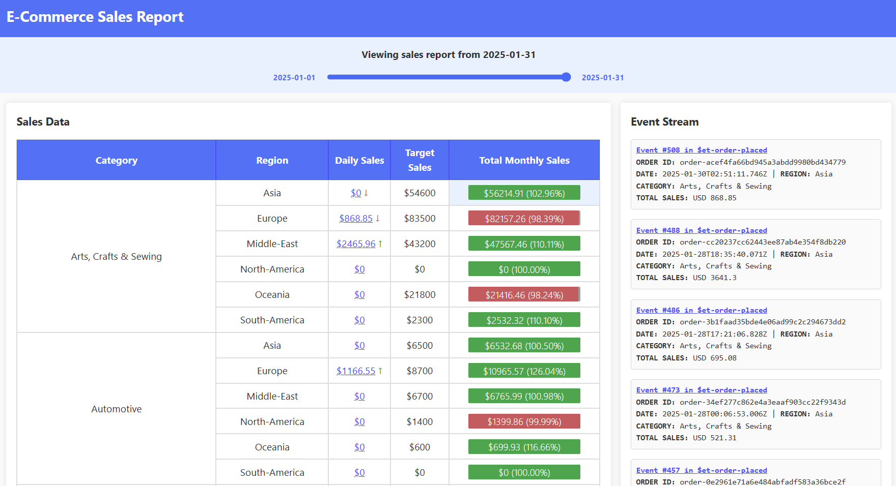

# Part 3: Project Events to Sales Report Read Model

Now that KurrentDB is initialized with a few hundred order events, you will project the events into a JSON file-read model and render it as a sales report on a web page.

### Introducing the Month End Sales Report

The month-end sales report summarizes total revenue from orders placed across all e-commerce stores worldwide. Sales figures are broken down by product category and region.

The report also includes the monthly sales target to support forecasting and performance management.

The report also includes a month end sales target, which helps with forecasting and performance management.



## Step 4: Start the Report Projection Application

The Report Projection Application listens for `OrderPlaced` events and updates a JSON read model that represents the sales report. This read model is saved to disk and used to display the sales report on a web page.

::: tip Read Model: Flexibility to Choose the Right Data Model and Store
Read models built from events can be stored in many ways, such as relational or document databases, but you are not limited to these options. In this example, a JSON file on local disk is used to show that any type of persistent storage is acceptable.

For instance, the read model could also be saved as a PDF for emailing to management, or as a rendered HTML file that can be cached and served directly to browsers.

You have complete flexibility in choosing the data model and storage method for your read model.

[Click here](/getting-started/use-cases/mix-and-match-database/introduction.md) for more information about this.
:::

1. Run this command in the terminal to start the report projection application:
   
   ```sh
   ./scripts/start-app.sh
   ```

   You will receive a message, like below, printed in the terminal:

   ```
   All apps are running.
   ```

2. Run this command in the terminal to view the application log of the report projection application in follow mode:

   ```sh
   docker compose --profile app logs -f
   ```

   Within a few seconds, you should see many messages that indicate the read model is being updated:

   ```
   reportprojection  | Projected event #XXX order-placed
   ```

3. Press `ctrl + c` to exit follow mode.

4. Run this command in the terminal to open the main program for the order processor application:

   ```sh
   code ./data/report-read-model.json
   ```
   
   You should see a json structure similar to this:

   ```json
   {
      "checkpoint": 534,
      "salesReports": {
         "2025-01-31": {
            "categories": {
               "Arts, Crafts \u0026 Sewing": {
                  "regions": {
                     "Asia": {
                        "dailySales": 0,
                        "monthEndSalesTarget": 54600,
                        "totalMonthlySales": 56214.91,
                        "targetHitRate": 1.03
                     },
                     "Europe": {
                        "dailySales": 868.85,
                        "monthEndSalesTarget": 83500,
                        "totalMonthlySales": 82157.26,
                        "targetHitRate": 0.98
                     },
                     // .....
                  }
               },
               "Automotive": {
                  "regions": {
                     "Asia": {
                        "dailySales": 0,
                        "monthEndSalesTarget": 6500,
                        "totalMonthlySales": 6532.68,
                        "targetHitRate": 1.01
                     },
                     "Europe": {
                        "dailySales": 1166.55,
                        "monthEndSalesTarget": 8700,
                        "totalMonthlySales": 10965.57,
                        "targetHitRate": 1.26
                     },
                     // .....
                
   ```

   ::: details Details of the Read Model 

   | Field                      | Description                                                                                   |
   |----------------------------|-----------------------------------------------------------------------------------------------|
   | `checkpoint`               | The last processed event number (used for resuming projections).                              |
   | `salesReports`             | Maps report dates (YYYY-MM-DD) to their sales data.                                           |
   | └─ *date*                  | Contains sales data for the given date.                                                       |
   | &nbsp;&nbsp;└─ `categories`| Maps product categories to their data (e.g. Automotive, Beauty, Electronics).                                                        |
   | &nbsp;&nbsp;&nbsp;&nbsp;└─ *category* | Contains sales data for the category.                                              |
   | &nbsp;&nbsp;&nbsp;&nbsp;&nbsp;&nbsp;└─ `regions` | Maps regions to their sales data (e.g. Asia, Europe, North-America).                                     |
   | &nbsp;&nbsp;&nbsp;&nbsp;&nbsp;&nbsp;&nbsp;&nbsp;└─ *region* | Contains sales metrics for the region.                     |
   | &nbsp;&nbsp;&nbsp;&nbsp;&nbsp;&nbsp;&nbsp;&nbsp;&nbsp;&nbsp;└─ `dailySales`         | Sales for the reported day.           |
   | &nbsp;&nbsp;&nbsp;&nbsp;&nbsp;&nbsp;&nbsp;&nbsp;&nbsp;&nbsp;└─ `monthEndSalesTarget`| The sales target for the month.                |
   | &nbsp;&nbsp;&nbsp;&nbsp;&nbsp;&nbsp;&nbsp;&nbsp;&nbsp;&nbsp;└─ `totalMonthlySales`  | The total sales for the month.                 |
   | &nbsp;&nbsp;&nbsp;&nbsp;&nbsp;&nbsp;&nbsp;&nbsp;&nbsp;&nbsp;└─ `targetHitRate`      | Ratio of actual sales to target.                |
   
   :::

   The structure of `report-read-model.json` is intentionally **denormalized**. This means the data is organized and pre-built for direct use, in this case, by the web page.

   ::: info What Does "Denormalized" Mean?
   A denormalized read model stores related and pre-computed data together, such as sales totals by category and region, in a format optimized for fast querying and display. Unlike normalized data structures, which separate data into multiple related models, a denormalized model keeps all the information needed for a report or user interface in one place. This approach eliminates the need for complex joins or calculations at query time, allowing front-end applications to use the data directly.

   Denormalization is especially common for read models generated from KurrentDB events, as it enables applications to efficiently present and analyze event data without requiring additional processing at runtime.

   Denormalization is a common for read models generated from KurrentDB events, since it allows applications to efficiently present and analyze event data without extra processing.
   :::

## Step 5: Start and Browse the Report Web Application

1. Run this command in the terminal to start the sales report web application:
   
   ```sh
   ./scripts/start-web.sh
   ```

   You will receive a message, like below, printed in the terminal:

   ```
   All apps are running.

   URL to Demo Web Application 👉 http://XXXXXXXX
   ```

2. Copy the URL printed in the terminal and navigate to it in a browser.

   You should see the sales report with structure and figures that match the read model generated previously.

   ::: info Quick Quiz
   Do the numbers in the report match the ones in `report-read-model.json`?
   :::

## Step 6: Examine the Report Projection Application

The Report Projection Application performs the following steps:

- Connects to KurrentDB and subscribes to the `$et-order-placed` stream
- Loads the existing sales report read model from disk, or creates a new one if none exists
- Reads the last processed event position (checkpoint) from the read model
- Processes each `OrderPlaced` event by updating sales totals by date, category, and region
- Updates the checkpoint after each event
- Saves the updated read model as a JSON file after every event

1. Run this command in the terminal to open the main program for the projection application:

   ```sh
   code ./ReportProjection/Program.cs
   ```

   Most of the code snippets leveraged in this step can be found within this file.

2. Locate and examine the code that deserializes the JSON file to read model:

   ```cs
   // --------------------------------- //
   // Deserialize JSON to report object //
   // --------------------------------- //
   var readModelPath =                                                      // Get the path to the report read model from an environment variable
      Environment.GetEnvironmentVariable("OUTPUT_FILEPATH") ?? 
      "data/report-read-model.json"; 

   var hasExistingReadModel = File.Exists(readModelPath);

   var readModel = LoadOrCreateReadModel(readModelPath);                    // Deserialize the JSON file into a ReportReadModel object

   // ...

   ReportReadModel LoadOrCreateReadModel(string readModelPath)
   {
      return File.Exists(readModelPath)                                    // Check if the read model file exists
         ? JsonSerializer.Deserialize<ReportReadModel>(                    // If it does, deserialize it
               File.ReadAllText(readModelPath))                            // By reading the file contents and deserialize to ReportReadModel
            ?? new ReportReadModel()                                       // If file is not found or deserialization fails
         : new ReportReadModel();                                          // create a new empty ReportReadModel object 
   }
   ```

   The read model is retrieved by reading the JSON file from a location specified by an environment variable. If the file exists and can be read successfully, it is deserialized into a `ReportReadModel` object. If the file doesn't exist or deserialization fails, a new empty `ReportReadModel` object is created instead.

3. Locate and examine the code that retrieves the last checkpoint:

   ```cs
   // ---------------------------------------------------------- //
   // Retrieve the last checkpoint position from JSON Read Model //
   // ---------------------------------------------------------- //

   var streamPosition = hasExistingReadModel                                // Check if the checkpoint exists..
      ? FromStream.After(StreamPosition.FromInt64(readModel.Checkpoint))    // if so, subscribe from stream after checkpoint..
      : FromStream.Start;                                                   // otherwise, subscribe from the start of the stream
   ```

   The checkpoint is retrieved from the deserialized read model. If no read model/checkpoint is found or it is the first time the application is executed, we can retrieve the default start position.

   ::: info Understanding Checkpoints
   A projection often uses a checkpoint to recover the position of the last processed event. This way, when an application unexpectedly crashes mid-process, the projection does not have to process all the previously processed events.
   :::

   ::: info Storing Checkpoints for Read Models Stored as File
      Checkpoints for read models that are stored as files can often be conveniently saved within the file along with the data structure. This way both the checkpoint and read model can be atomically saved together:

      ```json
      {
         "checkpoint": 42,     // <--- CHECKPOINT
         "salesReports": {     // <--- READ MODEL
            "2025-01-31": {
               "categories": {
                  "Electronics": {
                     "regions": {
                        "Asia": {
                           "dailySales": 5200.25,
                           "monthEndSalesTarget": 6000.00,
                           "totalMonthlySales": 60200.90,
                           "targetHitRate": 86.71
                        },
                        // ...
      ```
   :::

4. Locate and examine the code that subscribes to stream:

   ```cs
   await using var subscription = kurrentdb.SubscribeToStream(              // Subscribe to events..
      "$et-order-placed",                                                  // from the order placed event type system projection..        
      streamPosition,                                                      // from this position..
      true);                                                               // with linked events automatically resolved (required for system projections)

   ```

   A subscription is created that subscribes to events from the `$et-order-placed` stream. The subscription will only retrieve events starting from `streamPosition` in the stream (i.e., the checkpoint retrieved from the previous step).

   ::: info Different Types of Subscriptions
   This sample uses catch-up subscriptions to subscribe to events. You can also use persistent subscriptions or connectors to achieve a similar result. 

   For more information about catch-up subscriptions, [click here](/clients/grpc/subscriptions.html).
   For more information about persistent subscriptions, [click here](/clients/grpc/persistent-subscriptions.html). 
   For more information about connectors, [click here](/server/v24.10/features/connectors/).
   :::

5. Locate and examine the code that processes each event:

   ```cs
   await foreach (var message in subscription.Messages)                     // Iterate through the messages in the subscription
   {
      if (message is not StreamMessage.Event(var e)) continue;             // Skip this message if it is not an event

      if (EventEncoder.Decode(e.Event.Data, "order-placed")                // Try to deserialize the event to an OrderPlaced event
               is not OrderPlaced orderPlaced) continue;                    // Skip this message if it is not an OrderPlaced event

      ReportProjection.ReportProjection.ProjectOrderToReadModel(           // Project the event to the read model
         orderPlaced, readModel);

      readModel.Checkpoint = e.OriginalEventNumber.ToInt64();              // Set the read model checkpoint to the event number of the event we just read

      SaveReadModel(readModel, readModelPath);                             // Save the read model to the JSON file

      Console.WriteLine($"Projected event " +
                        $"#{e.OriginalEventNumber.ToInt64()} " +
                        $"{e.Event.EventType}");
   }
   ```

   For each event, the previous code:
   - Filters for valid event messages and order-placed events only
   - Updates the read model with each order via `ProjectOrderToReadModel`
   - Tracks progress by updating the checkpoint in the read model after each event
   - Persists changes by saving the updated model to JSON
   - Runs continuously to handle the event stream

   ::: warning Updating Read Model and Checkpoints Atomically
   To ensure atomicity and consistency, the updates to the read model and checkpoint should be committed within the same transaction. This guarantees that the update to both will succeed or fail together, preventing data inconsistencies like outdated read models or incorrect checkpoint positions. It also simplifies error recovery and ensures the system remains in sync.
   :::

   ::: info Exactly-once processing with Catch-up Subscription
   This implementation ensures exactly-once processing by using KurrentDB for reliable persistence, idempotent projection logic, and transactional updates. The read model and checkpoint are updated atomically, preventing duplicates or inconsistencies, unlike traditional message brokers that rely on at-least-once or at-most-once delivery.
   :::

## Step 7: Examine the Report Projection Logic

In this step, you will explore the report projection logic that transforms the order events into the month-end sales reports. The code located in `./ReportProject/ReportProjection.cs`:

- Takes an OrderPlaced event and a ReportReadModel as inputs
- Extracts key information like order date and geographic region
- Updates two sales metrics in the report for each product category and region:
   - Monthly sales totals
   - Daily sales


1. Run this command in the terminal to open the main program for the projection application:

   ```sh
   code ./ReportProjection/ReportProjection.cs
   ```

   This file is responsible for transforming `ReportReadModel` based on an `OrderPlaced` event.

2. Locate and examine `ProjectOrderToReadModel()`:

   ```cs
   public static void ProjectOrderToReadModel(OrderPlaced orderPlaced, ReportReadModel readModel)
    {
        var orderDate = DateOnly.FromDateTime(orderPlaced.At!.Value.DateTime);  // Convert the order date to DateOnly without time 

        var orderRegion = orderPlaced.Store!.geographicRegion!;                 // Get the order region from the store object

        var finalDayOfTheMonth =                                                // Get the last day of the month for the order date
            new DateOnly(orderDate.Year, orderDate.Month, 
                DateTime.DaysInMonth(orderDate.Year, orderDate.Month));

        ProjectToMonthEndReport();                                              // Project the order to the month-end report

        //...
   }
   ```

   `ProjectOrderToReadModel()` is the main method of the projection which takes the `OrderPlaced` event and updates the `ReportReadModel` that is passed in.

   The method prepares several variables for the projection and calls `ProjectToMonthEndReport()`.

3. Locate and examine `ProjectToMonthEndReport()`:

   ```cs
   void ProjectToMonthEndReport()                                          // Project the order to the monthly sales for the last day of the month
   {
      ProjectToMonthlySales(finalDayOfTheMonth);                           // Project to monthly sales for the last day of the month

      if (orderDate == finalDayOfTheMonth)                                 // If the order date is the last day of the month{
            ProjectToDailySales(finalDayOfTheMonth);                       // Project the order's total to daily sales for the last day of the month

   }
   ```

   `ProjectToMonthEndReport()` adds the order’s total to the monthly sales for the month-end report. If the order is placed on the last day of the month, it also adds the total to the daily sales for that day. These updates are performed using the `ProjectToMonthlySales()` and `ProjectToDailySales()` methods.

4. Locate and examine `ProjectToMonthlySales()` and `ProjectToDailysales()`:

   ```cs
   // Project the order's totals to monthly sales
   void ProjectToMonthlySales(DateOnly reportDate)
   {
      var report = GetReportAsOf(reportDate);                             // Get the report as of the requested date
      foreach (var lineItem in orderPlaced.LineItems!)                    // Iterate through each line item in the order
      {
            report.IncrementMonthlySales(lineItem.category, orderRegion,  // Increment the monthly sales by line item's total
               lineItem.total);                                             
      }
   }

   // Project the order's totals to daily sales
   void ProjectToDailySales(DateOnly reportDate)
   {
      var report = GetReportAsOf(reportDate);                             // Get the report as of the requested date
      foreach (var lineItem in orderPlaced.LineItems!)                    // Iterate through each line item in the order
      {
            report.IncrementDailySales(lineItem.category, orderRegion,    // Increment the daily sales by line item's total
               lineItem.total); 
      }
   }
   ```

   Both methods first retrieve the month-end report and then increment the daily or monthly sales for the appropriate category and region. This is done for each line item in the order.