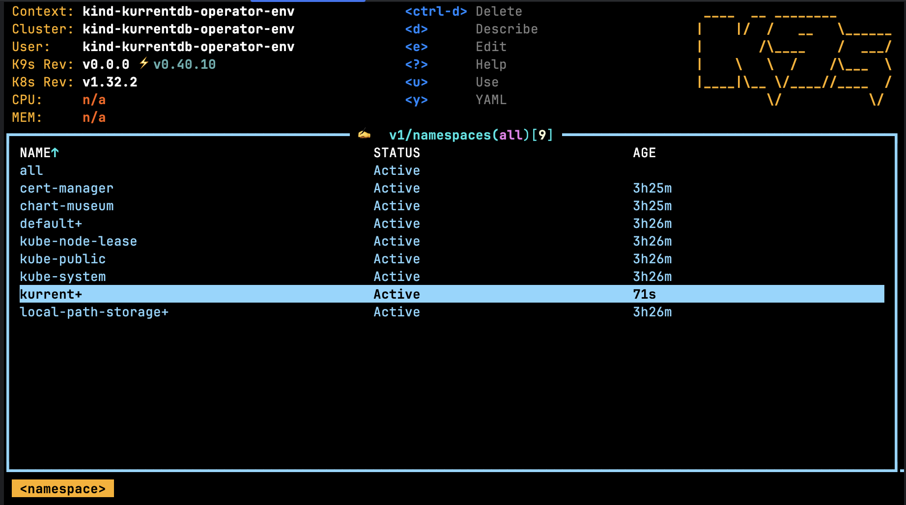
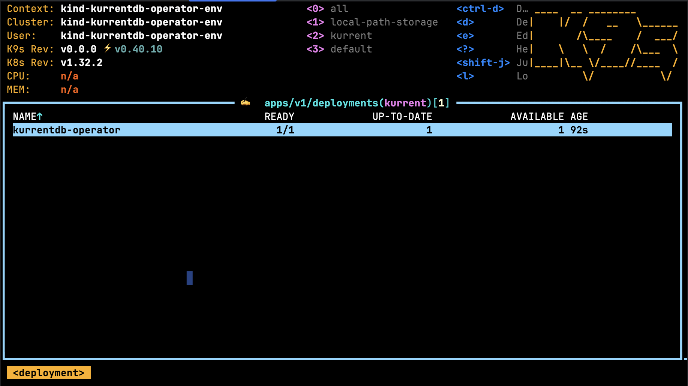
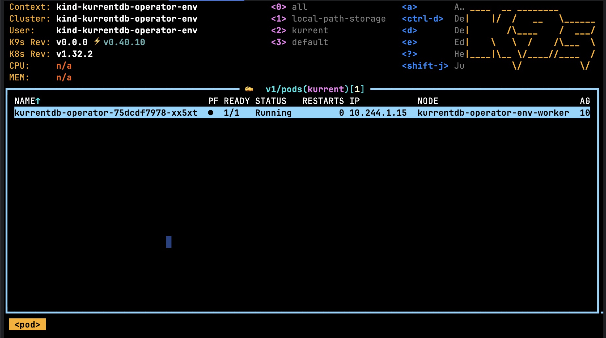
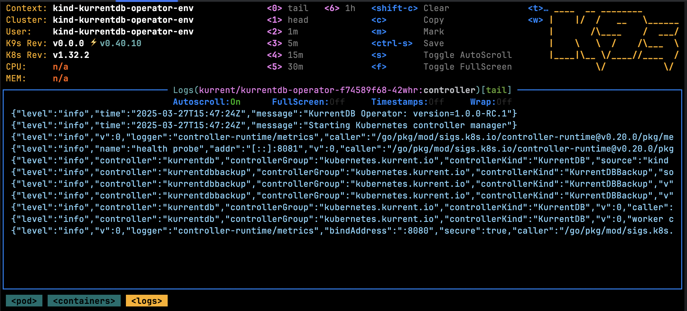

This section covers the various aspects of installing the Operator.

::: important
The Operator is an Enterprise only feature, please [contact us](https://www.kurrent.io/contact) for more information.
:::

## Prerequisites

::: tip
To get the best out of this guide, a basic understanding of [Kubernetes concepts](https://kubernetes.io/docs/concepts/) is essential.
:::

* A Kubernetes cluster running `v1.23.1` or later.
* Permission to create resources, deploy the Operator and install CRDs in the target cluster. 
* The following CLI tools installed, on your shell’s `$PATH`, with `$KUBECONFIG` pointing to your cluster: 
  * kubectl [install guide](https://kubernetes.io/docs/tasks/tools/install-kubectl)
  * k9s [install guide](https://k9scli.io/topics/install/)
  * Helm 3 CLI [install guide](https://helm.sh/docs/intro/install/)
  * A valid Operator license. Please [contact us](https://www.kurrent.io/contact) for more information.

## Configure Helm Repository

Add the Kurrent Helm repository to your local environment:

```bash
helm repo add kurrent-latest \
  'https://packages.kurrent.io/basic/kurrent-latest/helm/charts/'
```

## Install Custom Resource Definitions (CRDs)

The Operator uses Custom Resource Definitions (CRDs) to extend Kubernetes. You can install them automatically with Helm or manually.

The following resource types are supported:
- [KurrentDB](resource-types.md#kurrentdb)
- [KurrentDBBackup](resource-types.md#kurrentdbbackup)

Since CRDs are managed globally by Kubernetes, special care must be taken to install them.

### Automatic Install

It's recommended to install and manage the CRDs using Helm. See [Deployment Modes](#deployment-modes) for more information.

### Manual Install

If you prefer to install CRDs yourself:

```bash
# Download the kurrentdb-operator Helm chart
helm pull kurrent-latest/kurrentdb-operator --version 1.0.0 --untar
# Install the CRDs
kubectl apply -f kurrentdb-operator/templates/crds
```
*Expected Output*:
```
customresourcedefinition.apiextensions.k8s.io/kurrentdbbackups.kubernetes.kurrent.io created
customresourcedefinition.apiextensions.k8s.io/kurrentdbs.kubernetes.kurrent.io created
```

## Deployment Modes

The Operator can be scoped to track Kurrent resources across **all** or **specific** namespaces.

### Cluster-wide

In cluster-wide mode, the Operator tracks Kurrent resources across **all** namespaces and requires `ClusterRole`. Helm creates the ClusteRole automatically.

To deploy the Operator in this mode, run:

```bash
helm install kurrentdb-operator kurrent-latest/kurrentdb-operator \
  --version 1.1.0 \
  --namespace kurrent \
  --create-namespace \
  --set crds.enabled=true \
  --set-file operator.license.key=/path/to/license.key \
  --set-file operator.license.file=/path/to/license.lic
```

This command: 
- Deploys the Operator into the `kurrent` namespace (use `--create-namespace` to create it). Feel free to modify this namespace. 
- Creates the namespace (if it already exists, leave out the `--create-namespace` flag)
- Deploys CRDs (this can be skipped by removing `--set crds.enabled=true`)
- Applys the Operator license
- Deploys a new Helm release called `kurrentdb-operator` in the `kurrent` namespace.

*Expected Output*:
```
NAME: kurrentdb-operator
LAST DEPLOYED: Thu Mar 20 14:51:42 2025
NAMESPACE: kurrent
STATUS: deployed
REVISION: 1
TEST SUITE: None
```

Once installed, navigate to the [deployment validation](#deployment-validation) section.

### Specific Namespace(s)

In this mode, the Operator will track Kurrent resources across **specific** namespaces. This mode reduces the level of permissions required. The Operator will create a `Role` in each namespace that it is expected to manage.

To deploy the Operator in this mode, the following command can be used:

```bash
helm install kurrentdb-operator kurrent-latest/kurrentdb-operator \
  --version 1.1.0 \
  --namespace kurrent \
  --create-namespace \
  --set crds.enabled=true \
  --set-file operator.license.key=/path/to/license.key \
  --set-file operator.license.file=/path/to/license.lic \
  --set operator.namespaces='{kurrent, foo}'
```

Here's what the command does:
- Sets the namespace of where the Operator will be deployed i.e. `kurrent` (feel free to change this)
- Creates the namespace (if it already exists, leave out the `--create-namespace` flag)
- Deploys CRDs (this can be skipped by removing `--set crds.enabled=true`)
- Configures the Operator license
- Sets the underlying Operator configuration to target the namespaces: `kurrent` and `foo`
- Deploys a new Helm release called `kurrentdb-operator` in the `kurrent` namespace

::: important
Make sure the namespaces listed as part of the `operator.namespaces` parameter already exist before running the command (unless you are using the Operator to target the namespace that it will be deployed in to).
:::

*Expected Output*:
```
NAME: kurrentdb-operator
LAST DEPLOYED: Thu Mar 20 14:51:42 2025
NAMESPACE: kurrent
STATUS: deployed
REVISION: 1
TEST SUITE: None
```

Once installed, navigate to the [deployment validation](#deployment-validation) section.

#### Augmenting Namespaces

The Operator deployment can be updated to adjust which namespaces are watched. For example, in addition to the `kurrent` and `foo` namespaces (from the example above), a new namespace `bar` may also be watched using the command below:

```bash
helm upgrade kurrentdb-operator kurrent-latest/kurrentdb-operator \
  --version 1.1.0 \
  --namespace kurrent \
  --reuse-values \
  --set operator.namespaces='{kurrent,foo,bar}'
```

This will trigger:
- a new `Role` to be created in the `bar` namespace
- a rolling restart of the Operator to pick up the new configuration changes

## Deployment Validation

Using the k9s tool, navigate to the namespace listing using the command `:namespaces`. It should show the namespace where the Operator was deployed:



After stepping in to the `kurrent` namespace, type `:deployments` in the k9s console. It should show the following:



Pods may also be viewed using the `:pods` command, for example:



Pressing the `Return` key on the selected Operator pod will allow you to drill through the container hosted in the pod, and then finally to the logs:

