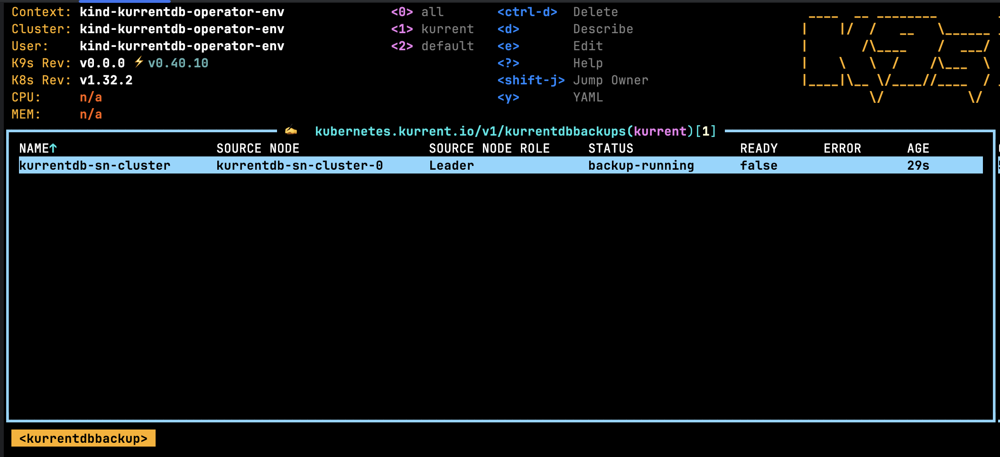

The sections below details how database backups can be performed. Refer to the [KurrentDBBackup API](../getting-started/resource-types.md#kurrentdbbackup) for detailed information.

## Backing up the leader

Assuming there is a cluster called `kurrentdb-cluster` that resides in the `kurrent` namespace, the following `KurrentDBBackup` resource can be defined:

```yaml
apiVersion: kubernetes.kurrent.io/v1
kind: KurrentDBBackup
metadata:
  name: kurrentdb-cluster
spec:
  volumeSnapshotClassName: ebs-vs
  clusterName: kurrentdb-cluster
```

In the example above, the backup definition leverages the `ebs-vs` volume snapshot class to perform the underlying volume snapshot. This class name will vary per Kubernetes cluster/Cloud provider, please consult with your Kubernetes administrator to determine this value.

The `KurrentDBBackup` type takes an optional `nodeName`. If left blank, the leader will be derived based on the gossip state of the database cluster.

The example above can be deployed using the following steps:
- Copy the YAML snippet above to a file called `backup.yaml`
- Run the following command:

```bash
kubectl -n kurrent apply -f backup.yaml
```

Once deployed, navigate to the [Viewing Backups](#viewing-backups) section.

## Backing up a specific node

Assuming there is a cluster called `kurrentdb-cluster` that resides in the `kurrent` namespace, the following `KurrentDBBackup` resource can be defined:

```yaml
apiVersion: kubernetes.kurrent.io/v1
kind: KurrentDBBackup
metadata:
  name: kurrentdb-cluster
spec:
  volumeSnapshotClassName: ebs-vs
  clusterName: kurrentdb-cluster
  nodeName: kurrentdb-1
```

In the example above, the backup definition leverages the `ebs-vs` volume snapshot class to perform the underlying volume snapshot. This class name will vary per Kubernetes cluster, please consult with your Kubernetes administrator to determine this value.

The example above can be deployed using the following steps:
- Copy the YAML snippet above to a file called `backup.yaml`
- Run the following command:

```bash
kubectl -n kurrent apply -f backup.yaml
```

Once deployed, navigate to the [Viewing Backups](#viewing-backups) section.

## Viewing Backups

Using the k9s tool, navigate to the namespaces list using the command `:namespaces`, it should show a screen similar to:


From here, press the `Return` key on the namespace where the `KurrentDBBackup` was created, in the screen above the namespace is `kurrent`. Now enter the k9s command `:kurrentdbbackups` and press the `Return` key. The following screen will show a list of database backups for the selected namespace.



## Periodic Backups

You can use [Kubernetes ChronJobs](
https://kubernetes.io/docs/concepts/workloads/controllers/cron-jobs/) for basic periodic backup
functionality.
